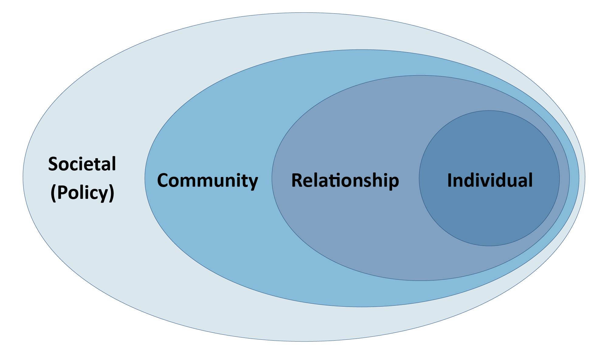

```{r setup, include=FALSE}
knitr::opts_chunk$set(echo = FALSE, warning = FALSE, message = FALSE, fig.width = 15, fig.height = 10)
library(dplyr)
library(leaflet)
library(leaflet.extras)
library(leaflet.mapboxgl)
library(tidycensus)
library(tigris)
library(tidyr)
library(here)
library(sf)
library(glue)

token <- Sys.getenv("MAPBOX_TOKEN")
options(mapbox.accessToken = token)
```

```{css, echo = FALSE}
.navbar-default .navbar-nav li a {
    color: white;
}

.navbar-default .navbar-nav li a:hover {
    color: white;
}
```

## Overview
* US incarcerates more people per capita then anywhere else 
* Incarceration rates: extremely costly for taxpayers
    + Halifax spends $21,000 per inmate and $78 per county resident 
* Goal: **social determinants** of incarceration & recidivism in Halifax, VA
* Approach: ecological model
    + How factors at the individual, relationship, community, and policy levels shape behavior 
<br> 

<!--  -->

<br> 
* Workflow: illustrates relationship between factors 
<br>

<!--  -->
<br>

<br><br><br>

## Data Sources 

* Exploratory data analysis and mapping for factors:
    + Unemployment, substance abuse, affordable housing, family structure
```{r}
sources <- readr::read_csv(here::here("data", "working", "data_sources_final.csv")) %>%
  select(-X4) %>%
  filter(Topic != "Schooling") %>%
  select(Source, Topic, Description)

knitr::kable(sources, "html") %>%
  kableExtra::kable_styling(bootstrap_options = c("striped", "bordered"), full_width = FALSE)
```
* Challenges
    + Lack of relevance to formerly incarcerated population
    + Improper spatial resolution
    + Incarceration vs crime 

<br> 

<br><br><br>

## Findings

### Background
* Halifax is a rural county of 34,000 with 60% of population being White, and 34% being Black 
  + Racial disparities in income: White median income ($48,000) vs Black median income ($30,400)
```{r, results = "hide"}
age_sex_race_county <- st_read(here::here("data", "original", "ACS", "acs_age_sex_race_county.geojson"))
create_map <- function(.data, # spatial dataset to use
                       variables, # character vector of names to be used, does not include _estimate or _moe at end. Example: estimate_percent_below_poverty_level_population_for_whom_poverty_status_is_determined
                       group_names, # The names to appear on the radio button widget, determing which variable to display
                       legend_name, # name of the legend
                       label_name, # What precedes the variable value on the hoverover label
                       scale_domain, # over what values is the scale defined? Values outside will be color NA
                       scale_breaks, # what divides the colors of the scale? For a 4 color scale, and example would be c(0, 25, 50, 75, 100) Note endpoints are included
                       unstable_threshold # How many times larger does the estimate have to be than the margin of error to be considered non-null?
) {
  color_scale <- colorBin("BuPu", scale_domain, scale_breaks)
  
  check_unstable <- function(variable) {
    ifelse((.data[[glue("{variable}_estimate")]]) < unstable_threshold * .data[[glue("{variable}_moe")]],
           NA,
           .data[[glue("{variable}_estimate")]])
  }
  
  add_poly_layer <- function(map, variable, group_name, color_scale) {
    addPolygons(map, color = "#444444", weight = 0.5, smoothFactor = 0.5,
                opacity = 1.0, fillOpacity = 0.7,
                fillColor = color_scale(check_unstable(variable)),
                group = group_name,
                label = ~purrr::map(glue("<strong>{NAME.x} County<br/></strong>
                                  <strong>{label_name}</strong>: {.data[[paste0(variable, \"_estimate\")]]}<br/>
                                  <strong>MOE</strong>: {.data[[paste0(variable, \"_moe\")]]}"), htmltools::HTML))
  }
  
  map <- leaflet(.data, width = "100%") %>%
    addMapboxGL(style = "mapbox://styles/mapbox/light-v9") %>%
    addMapPane("border", zIndex = 410)
  
  for (i in 1:length(variables)) {
    map <- map %>%
      add_poly_layer(variable = variables[i], group_name = group_names[i], color_scale = color_scale)
  }
  
  map <- map %>%
    addLegend("bottomright", pal = color_scale, values = .data[[glue("{variables[1]}_estimate")]],
              title = legend_name,
              opacity = .9
    )
  
  if(!is.null(group_names)) {
    map <- map %>%
      addLayersControl(
        baseGroups = group_names,
        options = layersControlOptions(collapsed = FALSE)
      )
  }
  
  map
}

halifax_border <- tigris::counties(state = "VA", cb = TRUE, resolution = "20m") %>% 
  st_as_sf() %>% 
  st_transform(crs = 4326) %>%
  filter(GEOID == 51083)
```
```{r, fig.height = 4}
#BAMMtools::getJenksBreaks(age_sex_race_county$percent_estimate_race_total_population_one_race_black_or_african_american_estimate, 6)
pal <- colorBin("BuPu", domain = c(0, 1), bins = c(0, 10, 22, 35, 50, 75))

create_map(age_sex_race_county, c("percent_estimate_race_total_population_one_race_black_or_african_american", "percent_estimate_race_total_population_one_race_white"),
           group_names = c("Black" ,"White"),
           legend_name = "Percentage Selected Race",
           label_name = "Percentage",
           scale_domain = c(0, 1),
           scale_breaks = c(0, 10, 25, 40, 60, 75, 90, 100),
           unstable_threshold = 1.5) %>%
  addPolylines(data = halifax_border,
               color = "#FC4444",
               opacity = 0.9,
               weight = 2,
               options = pathOptions(pane = "border"))
```

<br>

<br><br><br>

### Incarceration, Crime & Arrests
* Crime, arrest, incarceration & jails vs prisons 
* Prison incarceration rates have *consistently increased* over the past 3-4 decades 
```{r load_libs_data}
library(here)
library(dplyr)
library(readr)
library(lubridate)
library(ggplot2)
library(stringr)
library(tigris)
library(tidycensus)
library(sf)
library(patchwork)
library(leaflet)
library(leaflet.mapboxgl)
library(purrr)
library(glue)
library(tidyr)
library(gghighlight)
library(plotly)
library(stringr)
library(vroom)

# all VA crimes between 2010 and 2019
all_va_crime <- vroom::vroom(here("data", "original", "Crime", "full_va_crime", "clean_all_arrest_all_years.csv"))

# VA county population by race from census
va_pop_by_race <- read_csv(here("data", "original", "Crime", "full_va_crime", "clean_county_pop_by_race.csv"))

# all Halifax county crimes between 2010 and 2019
halifax_crime <- all_va_crime %>% 
  filter(county_cap == "HALIFAX")

vera_data <- data.table::fread(here::here("data", "original", "Incarceration", "vera_incarceration_trends.csv")) %>% as.data.frame()

va_data <- vera_data %>% filter(state == "VA")
va_rural_data <- va_data %>% filter(urbanicity == "rural")

rates_by_gender_system <- va_data %>% 
  filter(!county_name %in% c("Hopewell city", "Charles City County", "Colonial Heights city")) %>%
  select(year, county_name, male_jail_pop_rate, female_jail_pop_rate, male_prison_pop_rate, female_prison_pop_rate) %>%
  #rename(Male = male_prison_pop_rate, Female = female_prison_pop_rate) %>%
  pivot_longer(names_to = "jail_gender_combo", cols = c("male_jail_pop_rate", "female_jail_pop_rate", "male_prison_pop_rate", "female_prison_pop_rate")) %>%
  mutate(system = ifelse(str_detect(jail_gender_combo, "jail"), "Jail", "Prison"),
         gender = ifelse(str_detect(jail_gender_combo, "female"), "Female", "Male"),
         gender = factor(gender, levels = c("Male", "Female")))

scale_max <- max(c(va_data$male_prison_pop_rate / 100, va_data$female_prison_pop_rate / 100), na.rm = TRUE)

theme_set(theme_minimal() +
            theme(plot.title = element_text(hjust = 0.5, color = "gray10", size = 24),
                  plot.subtitle = element_text(hjust = 0.5, color = "gray30", face = "italic", size = 20),
                  axis.title = element_text(size = 20, color = "gray10"),
                  axis.text = element_text(size = 18, color = "gray30"),
                  strip.text = element_text(size = 22, color = "gray30"),
                  panel.spacing = unit(4, "lines"),
                  legend.key.size = unit(3, "line"),
                  legend.text = element_text(size = 16, color = "gray30"),
                  legend.title = element_text(size = 22, color = "gray10")))

cbbPalette <- c("#E69F00", "#56B4E9", "#009E73", "#F0E442", "#0072B2", "#D55E00", "#CC79A7")

options(mapbox.accessToken = Sys.getenv("MAPBOX_TOKEN"))
```
```{r halifax_top_crimes}

halifax_crime_tally <- halifax_crime %>%
  group_by(offense_type) %>%
  tally 

per_clear_data <- halifax_crime %>%
  mutate(clearance_stat = case_when(incident_clearance == "Cleared by Arrest" ~ 1,
                                    incident_clearance != "Cleared by Arrest" ~ 0)
         ) %>%
  group_by(offense_type, clearance_stat) %>%
  summarise(perc_clear = n()) %>%
  group_by(offense_type) %>%
  mutate(perc_clear = perc_clear/sum(perc_clear) * 100) %>%
  filter(clearance_stat == 1) %>% 
  inner_join(halifax_crime_tally, by = "offense_type")


total_crime_plot <- halifax_crime_tally %>%
  inner_join(per_clear_data, by = c("offense_type", "n")) %>% 
  ggplot(aes(x = reorder(offense_type, n), y = n)) +
  geom_bar(stat = 'identity', fill = "#56B4E9") +
  coord_flip() + 
  labs(x = NULL,
       y = "Total Crimes Reported")

per_clear_plot <- halifax_crime %>%
  mutate(clearance_stat = case_when(incident_clearance == "Cleared by Arrest" ~ 1,
                                    incident_clearance != "Cleared by Arrest" ~ 0)
         ) %>%
  group_by(offense_type, clearance_stat) %>%
  summarise(perc_clear = n()) %>%
  group_by(offense_type) %>%
  mutate(perc_clear = perc_clear/sum(perc_clear) * 100) %>%
  filter(clearance_stat == 1) %>%
  inner_join(halifax_crime_tally, by = "offense_type") %>%
  ggplot(aes(x = reorder(offense_type, n), y = perc_clear)) +
  geom_bar(stat = 'identity', fill = "#56B4E9") +
  coord_flip() + 
  labs(x = NULL,
       y = "Percent of Crimes \nCleared by Arrest") +
  scale_y_continuous(labels = scales::label_percent(scale = 1)) +
  theme(axis.title.y=element_blank(),
        axis.text.y=element_blank(),
        axis.ticks.y=element_blank())


  
total_crime_plot + per_clear_plot + 
  plot_annotation(title = 'Reported Crimes and Arrest Rates: Halifax County')
```

<br>

<br><br><br>

### Employment
* Unemployment is a **large indicator of crime** and intersects w/ ecological model on multiple levels
* Halifax has slightly higher unemployment rate than VA avg 
```{r}
library(leaflet)
library(purrr)
library(dplyr)
library(glue)
library(sf)
library(ggplot2)
library(gghighlight)
library(leaflet.mapboxgl)

acs_unemployment_county_sp <- st_read(here::here("data", "original", "ACS", "acs_unemployment_county.geojson"),
                                      quiet = TRUE)

theme_set(theme_minimal() +
            theme(plot.title = element_text(hjust = 0.5, color = "gray10", size = 24),
                  plot.subtitle = element_text(hjust = 0.5, color = "gray30", face = "italic", size = 20),
                  axis.title = element_text(size = 20, color = "gray10"),
                  axis.text = element_text(size = 18, color = "gray30"),
                  strip.text = element_text(size = 22, color = "gray30"),
                  panel.spacing = unit(4, "lines"),
                  legend.key.size = unit(3, "line"),
                  legend.text = element_text(size = 16, color = "gray30"),
                  legend.title = element_text(size = 22, color = "gray10")))


county_info <- st_read(here::here("data", "working", "va_counties.geojson"),
                       quiet = TRUE)

laus_unemployment_county <- read.csv(here::here("data", "original","Unemployment", "laus_unemployment_county.csv")) %>%
  mutate(GEOID = substr(Series.ID, 6, 10)) %>%
  left_join(county_info, by = "GEOID") %>%
  mutate(year_month_frac = Year + 1/12 * (as.numeric(substr(Period, 2, 3)) - 1))

options(mapbox.accessToken = Sys.getenv("MAPBOX_TOKEN"))
```

```{r}
plot <- laus_unemployment_county %>%
  filter(NAME.x != "Halifax") %>%
  ggplot() +
  geom_line(aes(x = year_month_frac, y = Value, group = NAME.x), color = "#AAAAAA", alpha = .3) +
  geom_line(data = filter(laus_unemployment_county, NAME.x == "Halifax"),
            aes(x = year_month_frac, y = Value),
            color = "#d400d0") +
  theme_minimal() +
  labs(x = "Year",
       y = "Unemployment Rate",
       title = "Unemployment Rate of Halifax County",
       subtitle = "Against all other counties in Virginia",
       caption = "Halifax county rate shown in purple. All other counties shown in grey\nData from the Local Area Unemployment Survey") +
  coord_cartesian(ylim = c(0, 20)) +
  scale_x_continuous(breaks = seq(2010, 2020, by = 2),
                     labels = as.character(seq(2010, 2020, by = 2)))

plot
```

<br>

<br><br><br>

### Housing
* Ecological model:
    + Policy: eligibility for low-income opportunities limited by prior convictions
    + Interpersonal: reintegration into the community
* Size of annual number of jail discharges relative to subsidized housing capacity: 3x 
* Housing accessibility (physical proximity)

```{r}
library(here)
library(dplyr)
library(stringr)
library(ggplot2)
library(gghighlight)
library(tidyr)
library(leaflet)
library(leaflet.mapboxgl)
library(sf)

source(here("src", "Mapping", "isochrone_map.R"))

theme_set(theme_minimal() +
            theme(plot.title = element_text(hjust = 0.5, color = "gray10", size = 24),
                  plot.subtitle = element_text(hjust = 0.5, color = "gray30", face = "italic", size = 20),
                  axis.title = element_text(size = 20, color = "gray10"),
                  axis.text = element_text(size = 18, color = "gray30"),
                  strip.text = element_text(size = 22, color = "gray30"),
                  panel.spacing = unit(4, "lines"),
                  legend.key.size = unit(3, "line"),
                  legend.text = element_text(size = 16, color = "gray30"),
                  legend.title = element_text(size = 22, color = "gray10")))

## Read in all public housing data and clean county strings
pub_housing_summary <- vroom::vroom(here("data", "original", "Housing", "county_pub_housing_2013_2019.csv")) %>%
  replace("NA", NA) %>%
  mutate(across(everything(), function(col) ifelse(col == -1 | col == -4 | col == -5, NA, col))) %>% ## -1 = NA, -4 = Suppressed, -5 = % reporting too low
  mutate(name = str_extract(str_replace_all(str_to_lower(name), "[0-9]{3} ", ""), "^([^,])+"), ## County names have numbers for some years, include state name after a comma for some years. Clean these
         name = str_to_title(trimws(ifelse(str_detect(name, "city county"), str_replace_all(name, "county", ""), name)))) ## Clean duplicated counties that are labeled as both city and county

## Vera incarceration data
vera_data <- vroom::vroom(here::here("data", "original", "Incarceration", "vera_incarceration_trends.csv")) %>%
  as.data.frame() %>%
  mutate(fips = as.character(fips))

## Subset to overall HUD summary data
va_pub_housing <- pub_housing_summary %>%
  filter(program_label == "Summary of All HUD Programs", state == "VA")

halifax_pub_housing <- va_pub_housing %>% filter(code == "51083")

## Join on incarceration data for recent years
va_housing_vera <- vera_data %>%
  filter(state == "VA", year > 2011) %>%
  full_join(va_pub_housing, by = c("fips" = "code", "year" = "year"))
```

```{r, fig.height = 8}
drive_map <- create_map(drive_time_polys) %>% setView(lat = 36.6987, lng = -78.9014, zoom = 10)
drive_map
```

```{r}
library(here)
library(dplyr)
library(stringr)
library(ggplot2)
library(gghighlight)
library(tidyr)
library(leaflet)
library(leaflet.mapboxgl)
library(sf)

source(here("src", "Mapping", "isochrone_map.R"))

theme_set(theme_minimal() +
            theme(plot.title = element_text(hjust = 0.5, color = "gray10", size = 24),
                  plot.subtitle = element_text(hjust = 0.5, color = "gray30", face = "italic", size = 20),
                  axis.title = element_text(size = 20, color = "gray10"),
                  axis.text = element_text(size = 18, color = "gray30"),
                  strip.text = element_text(size = 22, color = "gray30"),
                  panel.spacing = unit(4, "lines"),
                  legend.key.size = unit(3, "line"),
                  legend.text = element_text(size = 16, color = "gray30"),
                  legend.title = element_text(size = 22, color = "gray10")))

## Read in all public housing data and clean county strings
pub_housing_summary <- vroom::vroom(here("data", "original", "Housing", "county_pub_housing_2013_2019.csv")) %>%
  replace("NA", NA) %>%
  mutate(across(everything(), function(col) ifelse(col == -1 | col == -4 | col == -5, NA, col))) %>% ## -1 = NA, -4 = Suppressed, -5 = % reporting too low
  mutate(name = str_extract(str_replace_all(str_to_lower(name), "[0-9]{3} ", ""), "^([^,])+"), ## County names have numbers for some years, include state name after a comma for some years. Clean these
         name = str_to_title(trimws(ifelse(str_detect(name, "city county"), str_replace_all(name, "county", ""), name)))) ## Clean duplicated counties that are labeled as both city and county

## Vera incarceration data
vera_data <- vroom::vroom(here::here("data", "original", "Incarceration", "vera_incarceration_trends.csv")) %>%
  as.data.frame() %>%
  mutate(fips = as.character(fips))

## Subset to overall HUD summary data
va_pub_housing <- pub_housing_summary %>%
  filter(program_label == "Summary of All HUD Programs", state == "VA")

halifax_pub_housing <- va_pub_housing %>% filter(code == "51083")

## Join on incarceration data for recent years
va_housing_vera <- vera_data %>%
  filter(state == "VA", year > 2011) %>%
  full_join(va_pub_housing, by = c("fips" = "code", "year" = "year"))
```
```{r, fig.height = 12}
## Relative plot
va_housing_vera %>%
  filter(year == 2017, !is.na(people_total), !is.na(total_jail_dis)) %>%
  mutate(isHalifax = ifelse(fips == "51083", "yes", "no"), 
         #capacity = 1 / (people_total / ((100 - pct_occupied) / 100)),
         capacity_color = ifelse(total_jail_dis > people_total, "above", "below"), 
         diff = total_jail_dis / people_total) %>%
  filter(urbanicity == "rural") %>%
  ggplot() +
  geom_segment(aes(x = reorder(county_name,diff), xend = reorder(county_name,diff), yend = 1, y = diff, alpha = isHalifax, color = capacity_color), size = 1) +
  geom_point(aes(x = reorder(county_name,-diff), y = diff, alpha = isHalifax, color = capacity_color), size = 3) +
  #geom_point(aes(x = reorder(fips,-people_total), y = people_total, alpha = isHalifax, color = capacity), size = 0.75) +
  scale_alpha_manual(values = c(0.3, 1)) +
  scale_color_manual(values = c("#FC4444","#6b6385")) +
  scale_y_log10(breaks = c(0.3, 1, 3, 10, 30), labels = c("0.3", "1", "3", "10", "30 \ntimes larger")) +
  #scale_y_continuous(breaks = c(1, 5, 10, 25, 50), labels = c("1", "5", "10", "25", "50 \ntimes larger")) +
  coord_flip() +
  labs(y = "", x=  "", title = "Size of Yearly Jail Discharge Population \nRelative to Subsidized Housing Capacity", subtitle = "Rural Virginia Localities") +
  theme(legend.position = "none",
        panel.grid.minor = element_blank(),
        plot.margin = margin(0.5, 2, 0, 0.5, "cm"))
```


<br>

<br><br><br>

### Substance Abuse
* Opioid prescription rates are declining, but still higher than VA and USA
* Steadily increasing rate of binge drinking
* Policy level: racial disparities in marijuana possession (and drug-related crime)

```{r}
library(ggplot2)
library(rvest)
library(sf)
library(tigris)
library(leaflet)
library(tidycensus)
library(stringr)
library(dplyr)
library(here)
library(BAMMtools)
library(tidyr)
library(leaflet.mapboxgl)

#set the theme 
theme_set(theme_minimal() +
            theme(plot.title = element_text(hjust = 0.5, color = "gray10", size = 24),
                  plot.subtitle = element_text(hjust = 0.5, color = "gray30", face = "italic", size = 20),
                  axis.title = element_text(size = 20, color = "gray10"),
                  axis.text = element_text(size = 18, color = "gray30"),
                  strip.text = element_text(size = 22, color = "gray30"),
                  panel.spacing = unit(4, "lines"),
                  legend.key.size = unit(3, "line"),
                  legend.text = element_text(size = 16, color = "gray30"),
                  legend.title = element_text(size = 22, color = "gray10")))

options(mapbox.accessToken = Sys.getenv("MAPBOX_TOKEN"))

cbbPalette <- c("#E69F00", "#56B4E9", "#009E73", "#F0E442", "#0072B2", "#D55E00", "#CC79A7")
```

```{r}
#read CSV
datasource <- readr::read_csv(here::here("data",
                                         "original", "Substance_Abuse",
                                         "CDC Opioid Prescription Data - Halifax.csv")) %>%
  pivot_longer(cols = c(Halifax, `US Total`, VA))

#plot the data
ggplot(data = datasource, aes(x = Year, y = value, color = name)) +
  #plot of Halifax and VA state over time
  geom_line(lwd = 1.1) +
  geom_point(size = 2) +
  labs(title = 'Opioid Prescriptions per 100 People') +
  #relabel the scale appropriately
  scale_color_manual(name = "Location", labels = c("Halifax", "US", "VA"), values = cbbPalette) +
  scale_x_continuous(labels = seq(2006, 2018), breaks = seq(2006, 2018)) +
  theme(panel.grid.minor = element_blank(),
        legend.title = element_blank(),
        legend.position = "bottom",
        axis.title = element_blank())
```
```{r, results = "hide"}
#load VA border geographical data
va_borders <- get_acs(table = "B01003", geography = "county", year = 2018, state = "VA",
                      survey = "acs5", geometry = TRUE, cache_table = TRUE) %>% st_transform(crs = 4326)
```


<br>

<br><br><br>

### Family Structure
* Family structure highly affects child's development
* Teen mothers more likely to drop out of high school, be unemployed, have lower incomes
    + Low levels of family supervision -> high rates of juvenile delinquency (cycle)
* Teen births, housing opportunities, and racial discrepancies are all important aspects

```{r, fig.height = 15, fig.width = 25}
## Pct of households headed by a single parent (most are females in Halifax - can show)
va_data <- pub_housing_summary %>%
  filter(year == 2019, program_label %in% c("Housing Choice Vouchers", "Project Based Section 8")) %>%
  mutate(isVA = ifelse(state == "VA", TRUE, FALSE),
         isHalifax = ifelse(state == "VA" & name == "Halifax County", TRUE, FALSE),
         pct_lt24_head = ifelse(is.na(pct_lt24_head), 100 - pct_age25_50 - pct_age51_61 - pct_age62plus, pct_lt24_head)) %>%
  filter(isVA == TRUE)

us_data <- pub_housing_summary %>%
  filter(year == 2019, program_label %in% c("Housing Choice Vouchers", "Project Based Section 8")) %>%
  mutate(isVA = ifelse(state == "VA", TRUE, FALSE),
         isHalifax = ifelse(state == "VA" & name == "Halifax County", TRUE, FALSE),
         pct_lt24_head = ifelse(is.na(pct_lt24_head), 100 - pct_age25_50 - pct_age51_61 - pct_age62plus, pct_lt24_head)) %>%
  filter(isVA == FALSE)

plot <- ggplot() +
  geom_point(data = us_data, aes(x = pct_black_nonhsp, y = pct_1adult, color = interaction(isVA, isHalifax), size = pct_lt24_head, alpha = isVA), stroke = 1.25) +
  geom_point(data = va_data, aes(x = pct_black_nonhsp, y = pct_1adult, color = interaction(isVA, isHalifax), size = pct_lt24_head, alpha = isVA), stroke = 1.25) +
  coord_flip() +
  scale_size_continuous(range = c(0, 20), labels = c("0%", "10%", "20%", "30%", "40%")) +
  scale_color_manual(labels = c("U.S.", "Virginia", "Halifax County"), values = c("#DDD9D5", "#6b6385", "#FC4444"), na.translate=FALSE) +
  labs(y = "\nPercent Single Adults with Children", x = "Percent Black (Non-Hispanic)\n", 
       title = "Characteristics of Subsidized Housing Population\n", 
       size = "Household heads less \nthan 24 years old") +
  guides(alpha = FALSE, color = guide_legend(title = "Locale", override.aes = list(size=10)), size = guide_legend(override.aes = list(shape = 21, alpha = 0.8))) +
  scale_alpha_manual(values = c(0.1, 0.8)) +
  facet_wrap(~program_label, ncol = 2) +
  theme_minimal() +
  theme(plot.title = element_text(hjust = 0.5, color = "gray10", size = 30),
        plot.subtitle = element_text(hjust = 0.5, color = "gray30", face = "italic", size = 26),
        axis.title = element_text(size = 26, color = "gray10"),
        axis.text = element_text(size = 24, color = "gray30"),
        strip.text = element_text(size = 28, color = "gray30"),
        panel.spacing = unit(4, "lines"),
        legend.key.size = unit(3, "line"),
        legend.text = element_text(size = 22, color = "gray30"),
        legend.title = element_text(size = 28, color = "gray10"))

plot
```
